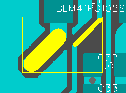
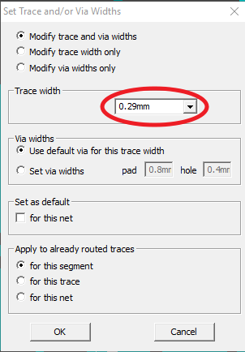

## You can change the width...

...of a segment and / or the size of the via. When the segment is highlighted, click `F1_Set_Width` button. You can apply new values to a segment, to a trace, or to a net. This function also works for a group of selected segments. 

Good to know for quick editing: When several segments of different widths have been selected, the width of the segment that was last clicked will be shown in the dialog box.

Thus, you can immediately press the OK button to make the width of both segments the same. This reduces editing time.

