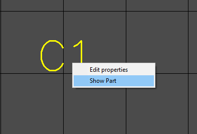

## How to select part?

Mouse over a part and left click. If you hit the pin, the pin will be highlighted, since the pin area is less than the area of the part. Need to click again. If there are too many objects, you can use the selection mask on the left side of the screen. Click on the "Parts" line with the control key pressed to invert the mask and allow the selection of parts only.

If the part is connected to other parts through the "merge" property, the merge will be highlighted. You need to click again or prohibit the "merge" in the selection mask.

If a part has only one pin, then in order to select it, you need to click while holding the CONTROL button.

It happens that the footprint of the part does not contain a single pin (for example, it has only graphic lines). But in the course of editing the PCB, graphics lines can be made hidden. In this case, the part will become completely invisible. To jump onto the part and further edit its footprint, right-click on the reference designation and select `Show Part` and then` F2 Edit Footprint`.

