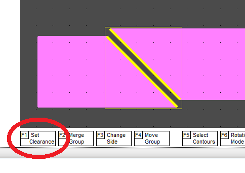

**Clearance between sides**

Often between the sides of the polygons of different nets you need to set a certain clearance. As well as when setting the clearance for trace segments, here you must first click on the movable side, and then click on the non-movable side, i.e. select two sides of the area while holding the CTRL button. And then use the F1_Set_Clearance button.

[return](How_to.md)
