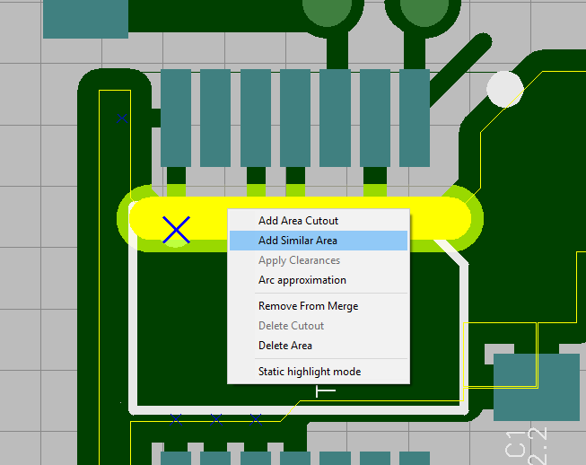
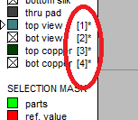

# How to add similar area?

To create a similar area, right-click on the selected segment of the polygon side and select the menu item Add_Similar_Area.

The drag mode starts. Specify the vertices of the area by left-clicking on pcb. To complete the drag, right-click.
These parameters will be inherited from the previous polygon:

- drawing width
- copper layer
- hatching style

To quickly change the layer of an area, select the segment of the polygon side and press SHIFT + layer number.

#[return](How_to.md)

