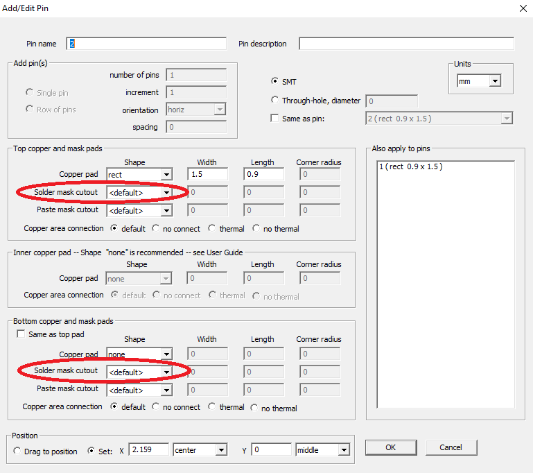

## `Swell pad for solder mask`

Usually a solder mask for the pads is chosen a little more than the pads themselves by a certain amount. This value is set in the CAM dialog box (called `swell pad for solder mask`), and is applied to all pads that have DEFAULT for the solder mask in their properties. To call the CAM-window press CTRL + G

  To open the pad properties you need to do the following:

1) Select the part of interest on the board (left click)
2) Press F2-Edit Footprint
3) Then select the pad in the footprint editor
4) Press F1-Edit Pad, a dialog box will open

