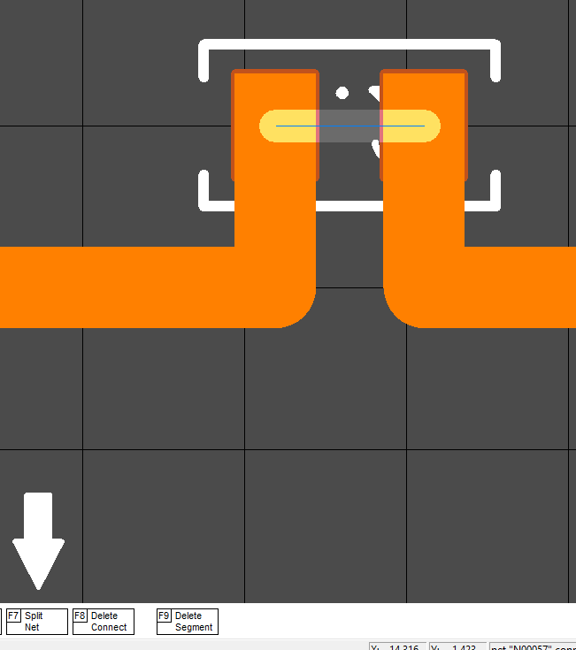
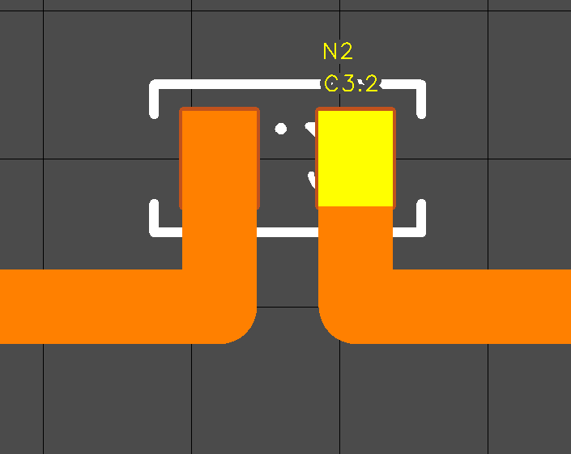

### SPLIT NET

Here both pins of this part have one common net. 

Sometimes you need to divide the net into two different ones, while preserving all the routes and polygons. The net can only be divided by Ratline.
To successfully divide the net into two parts, you must:

1) Select the Ratline by which you want to cut the net
2) Check this Ratline for the ability to split the network: try removing it. If the Ratline has disappeared, then it will not work to divide the net, otherwise the verification is successful and you can split the net here. Highlight this segment and press F7 (Split Net).

A new net "N2" has formed, which can be renamed. When the pin is highlighted, press F5 (Edit Net)

### [Return](How_to.md)
