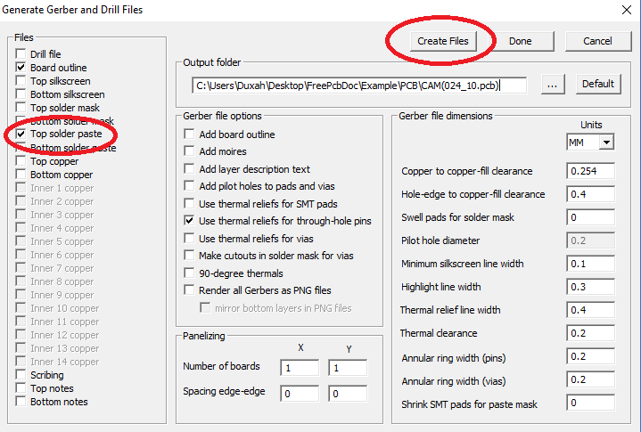

## `How to create gerber for the stencil?`

To create a paste mask stencil, you just need to create a gerber file for the paste layer using the CAM dialog box. Press ctrl + G, and select the paste layer in the window.

